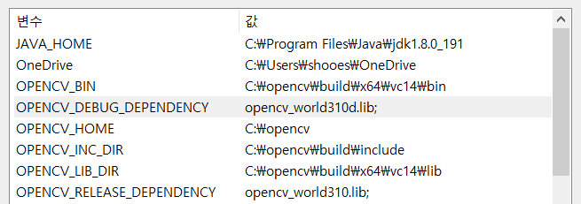

* Environment Variables
```
OPENCV_HOME=<your_opencv_home>
OPENCV_INC_DIR=<opencv_include_directory>
OPENCV_LIB_DIR=<opencv_library_directory>
OPENCV_BIN=<opencv_dll_directory>
OPENCV_DEBUG_DEPENDENCY=<opencv_lib_for_debug>
OPENCV_RELEASE_DEPENDENCY=<opencv_lib_for_release>

example)
OPENCV_HOME=C:\opencv
OPENCV_INC_DIR=%OPENCV_HOME%\build\include
OPENCV_LIB_DIR=%OPENCV_HOME%\build\x64\vc14\lib
OPENCV_BIN=%OPENCV_HOME%\build\x64\vc14\bin
OPENCV_DEBUG_DEPENDENCY=opencv_world310d.lib; //세미콜론 무조건 있어야 한다.
OPENCV_RELEASE_DEPENDENCY=opencv_world310.lib; //세미콜론 무조건 있어야 한다.
```



